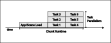

* Feature Name: Task Chunking
* RFC Tracking Issue: https://github.com/OpenJobDescription/openjd-specifications/issues/53
* Start Date: 2024-11-27
* Specification Version: 2023-09 extension TASK_CHUNKING
* Accepted On: 2025-01-17
* Depends On: RFC 0002 (https://github.com/OpenJobDescription/openjd-specifications/issues/57)

## Summary

This RFC proposes to address application and scene loading overhead by adding a mechanism
for chunking to the Open Job Description job template specification. Chunking is a way to
improve resource utilization in exchange for larger task runtimes. Render jobs often have
a single scene file that defines a scene graph including an animated camera, and output
one frame of a shot for each task. Instead of rendering one frame per CLI command,
with chunking the scheduler dispatches a set of frames. The chunk may be a contiguous range
like frames "1-10", or a selection of them like "1,3,4,7,8,10".

This proposal complements task stickiness, the approach already supported for loading
the application as a background daemon and then scheduling individual tasks to it without
closing the application.

## Basic Examples

### Contiguous chunks

This sample shows a job for a `render` CLI tool that supports `-start` and `-end` frame range parameters.
With the default `Frames` of "1,10-12,18-50" and `ChunkSize` of 10, a likely
division of the input frames into contiguous chunks is "1-1", "10-12", "18-27",
"28-37", "38-47", "48-50".

New syntax is annotated by comments:

```yaml
specificationVersion: 'jobtemplate-2023-09'
extensions:
- TASK_CHUNKING
name: Contiguous Chunks
parameterDefinitions:
  - name: SceneFile
    type: PATH
    objectType: FILE
    dataFlow: IN
  - name: Frames
    type: STRING
    default: 1,10-12,18-50
  - name: ChunkSize
    type: INT
    default: 10
steps:
  - name: Render
    parameterSpace:
      taskParameterDefinitions:
        - name: Frame
          ## The CHUNK[INT] task parameter type is added by this proposal
          type: CHUNK[INT]
          range: "{{Param.Frames}}"
          ## The chunks field must be provided for type CHUNK[INT]
          chunks:
            ## Required, is how big to make each chunk by default
            defaultTaskCount: "{{Param.ChunkSize}}"
            ## Optional and can be ignored by the scheduler. If supported,
            ## the scheduler adjusts the task count for chunks to match
            ## this runtime. The value is in seconds, so 900 is 15 minutes.
            targetRuntimeSeconds: 900
            ## Required, affects the script handling the onRun action.
            ## CONTIGUOUS means {{Task.Param.Frame}} always expands to
            ## "<startframe>-<endframe>", e.g. "1-1" or "11-20".
            rangeConstraint: CONTIGUOUS
    script:
      actions:
        onRun:
          command: bash
          args: ["{{Task.File.RenderChunk}}"]
      embeddedFiles:
        - name: RenderChunk
          filename: render.sh
          type: TEXT
          ## Because a CONTIGUOUS chunk is always like "<startframe>-<endframe>",
          ## this code can use the cut command to get the start and end values.
          data: |
            START_FRAME="$(echo '{{Task.Param.Frame}}' | cut -d- -f1)"
            END_FRAME="$(echo '{{Task.Param.Frame}}' | cut -d- -f2)"
            render -scenefile '{{Param.SceneFile}}' \
                -start "$START_FRAME" \
                -end "$END_FRAME"
```

### Non-contiguous chunks

This sample shows a job for the V-Ray CLI that supports arbitrary frame lists, as documented in
[V-Ray Standalone Command Line Options](https://docs.chaos.com/display/VNS/V-Ray+Standalone+Command+Line+Options).
Because V-Ray has a different frame range syntax than Open Job Description, the job performs
a character substitution for the value.

```yaml
specificationVersion: 'jobtemplate-2023-09'
extensions:
- TASK_CHUNKING
name: V-Ray with Non-contiguous Chunks
parameterDefinitions:
  - name: VRSceneFile
    type: PATH
    objectType: FILE
    dataFlow: IN
  - name: Frames
    type: STRING
    default: "1-60:2"
steps:
  - name: Render
    parameterSpace:
      taskParameterDefinitions:
        - name: Frame
          type: CHUNK[INT]
          range: "{{Param.Frames}}"
          chunks:
            defaultTaskCount: 10
            targetRuntimeSeconds: 600
            ## NONCONTIGUOUS means {{Task.Param.Frame}} expands to
            ## an arbitrary integer range expression, e.g. "1-3,5,7-20:2".
            rangeConstraint: NONCONTIGUOUS
    script:
       actions:
        onRun:
          command: bash
          args: ["{{Task.File.RenderChunk}}"]
      embeddedFiles:
        - name: RenderChunk
          filename: render.sh
          type: TEXT
          ## Because a NONCONTIGUOUS chunk is an arbitrary integer range expression,
          ## and the V-Ray -frame option accepts a similar syntax with different characters,
          ## this code can use the tr command to transform it into the V-Ray format.
          data: |
            # E.g. "1-3,5,7-20:2" becomes "1-3;5;7-20,2" for V-Ray
            FRAMES=$(echo '{{Task.Param.Frame}}' | tr ',:' ';,')
            vray -sceneFile='{{Param.VRSceneFile}}' \
                 -frames="$FRAMES"
```

## Motivation

Early design work for Open Job Description identified task chunking and task stickiness
(sending tasks to a background daemon) as two patterns for amortizing
application startup and scene loading time across many task runs. The first release
of Open Job Description provided the latter along with the
[openjd-adaptor-runtime library](https://github.com/OpenJobDescription/openjd-adaptor-runtime-for-python)
to support implementing task stickiness for applications with scripting support.
Many applications support command-line arguments for a contiguous or non-contiguous range
of frames to process, without the flexible scripting needed for task stickiness.
To support this diversity of application workload patterns, Open Job Description would benefit
by implementing both patterns. The combination of the two can be better than either alone,
when a single task cannot use all available CPU cores, but multiple tasks can run
in parallel on a host.

This proposal supports two ways to select the size of chunks. The first option is to
determine all the chunks when submitting the job, based on the required `defaultTaskCount`
field. If the selected value is too small, the job will run inefficiently because too
much time is spent on loading compared to running the tasks. If the selected value is too
large, each chunk takes long to process and cannot be load balanced across a larger fleet
of worker hosts. Therefore, the proposal provides an optional `targetRuntimeSeconds` field
specifying how long the user wants each chunk to take. The scheduler can start with
chunks sized according to `defaultTaskCount`, and then adjust it up or down to be closer
to the target runtime.

Initial render jobs typically use a contiguous interval of frame numbers like "1-100",
but then it can be necessary to render an arbitrary set of pick up frames like "7,12-14,95"
as a follow-up. This proposal makes it straightforward to write job templates that support
both patterns in simple syntax using a job parameter named `Frames` accepting
an integer range expression. The `rangeConstraint` field permits the flexibility of
noncontiguous chunks as well when the application interface supports it.

### Performance and efficiency

The purpose of chunking is to improve the performance and efficiency of jobs running
on worker hosts. We can model a chunk's runtime to help reason about that. The ratio
of load time to task runtime is an important input to choosing appropriate
chunks sizes. This ratio varies widely in practice, but can be quite large in GPU workloads
such as rendering with a game engine. These diagrams show a ratio large enough to
make its impact clear visually.

Some runtime data from a test Adobe After Effects rendering workload show a roughly ten times
performance improvement from 16m51s to 1m41s between invoking `aerender` one frame at a time
or in chunks of 50 frames. See
[this pull request description](https://github.com/aws-deadline/deadline-cloud-for-after-effects/pull/77)
for details.

Our model of chunk runtime starts an application and loads a scene, then runs tasks in parallel
until all the tasks in the chunk are done.



Here's an example timeline for running 15 tasks with this chunking on one worker host,
with chunk size 6 and task parallelism of 3.


Here's how the same tasks look with task stickiness. While it removed repeated loading times,
and the job benefits from multi-threaded parallelism within each task, it is not able
to run multiple tasks in parallel since the session gives it a single task at a time.


When combining chunking and task stickiness together, it removes the load time
while still allowing the application to run tasks in parallel.


The above diagrams show tasks that always take the exact same time. This is rarely
true. There will be a drop in parallelism when tasks are finishing at the end of
a chunk, without new tasks to start. Here's how that looks.


Users can select larger chunks to amortize this drop in parallelism, but there are
ways to address this remaining inefficency while still allowing a scheduler to handle
tasks individually and provide responsive load balancing. One possibility is
to introduce a mechanism that pipelines tasks from the scheduler to the step script.
Such a mechanism would add more complexity than the present chunking proposal,
and is left for future work.

## Specification

> Changes to [the template schema](https://github.com/OpenJobDescription/openjd-specifications/wiki/2023-09-Template-Schemas).

> A modification to [`<TaskParameterDefinition>`](https://github.com/OpenJobDescription/openjd-specifications/wiki/2023-09-Template-Schemas#341-taskparameterdefinition)

```diff
  <TaskParameterDefinition> ::= <IntTaskParameterDefinition> | <FloatTaskParameterDefinition> |
-                               <StringTaskParameterDefinition> | <PathTaskParameterDefinition>
+                               <StringTaskParameterDefinition> | <PathTaskParameterDefinition> |
+                               <ChunkIntTaskParameterDefinition>
```

> A new section `<ChunkIntTaskParameterDefinition>` after
> [section 3.4.1.4. `<PathTaskParameterDefinition>`](https://github.com/OpenJobDescription/openjd-specifications/wiki/2023-09-Template-Schemas#3414-pathtaskparameterdefinition).

### 3.4.1.5. `<ChunkIntTaskParameterDefinition>`

```diff
+ An integer valued task parameter, processed as chunks instead of as individual elements.
+ At most one `CHUNK[INT]` parameter can be specified in a step parameter space. When forming
+ a chunk to run, all the non-chunked dimensions take on a single value, and the chunked dimension
+ takes a set of values that satisfies the range constraint. A `<ChunkIntTaskParameterDefinition>` is the object:
+
+ ```yaml
+   name: <Identifier>
+   type: "CHUNK[INT]"
+   range: <IntRangeList> | <IntRangeExpr>
+   chunks:
+     defaultTaskCount: <integer> | <intstring> # @fmtstring
+     targetRuntimeSeconds: <integer> | <intstring> # @optional @fmtstring
+     rangeConstraint: "CONTIGUOUS" | "NONCONTIGUOUS"
+ ```
+
+ See section `<IntTaskParameterDefinition>` for the definitions of `<IntRangeExpr>` and `<intstring>`.
+
+ 1. *name* — The name of the parameter.
+ 2. *type* — The literal "CHUNK[INT]", defining this parameter as integer valued and processed
+     as chunks.
+ 3. *range* — The list of values that the parameter takes on to define Tasks of the Step.
+ 4. *chunks* — Specifies how to form sets of values into chunks.
+     1. *defaultTaskCount* — How many tasks to combine into a single chunk by default.
+        1. Minimum value: 1
+     2. *targetRuntimeSeconds* — If provided and its value is greater than 0, the number of seconds
+         to aim for when forming chunks. A scheduler can ignore this, or dynamically adjust
+         the chunk task count to be closer to this value once some chunks have completed.
+         1. Minimum value: 0
+     3. *rangeConstraint* — If CONTIGUOUS, a chunk must always be a contiguous range
+         of integers with two integers separated by "-" like a single "5-5" or interval "1-10".
+         If NONCONTIGUOUS, a chunk can be an arbitrary set of integers following the
+         `<IntRangeExpr>` syntax like "1,3,7-10:2".
+ 5. `<IntRangeList>` is subject to the constraints:
+    * Minimum number of elements: If provided, then this list must contain at least one element.
+    * Maximum number of elements: The list must not contain more than 1024 elements.
+
+ The value of a task parameter of this type can be referenced in format strings that will be evaluated when running a Task
+ using the following names:
+
+ 1. `Task.Param.<name>` and
+ 2. `Task.RawParam.<name>`
```

> A new constraint and example for [section 3.4.3. `<CombinationExpr>`](https://github.com/OpenJobDescription/openjd-specifications/wiki/2023-09-Template-Schemas#343-combinationexpr)

### 3.4.3. `<CombinationExpr>`

```diff
...
  4. Each `<Identifier>` in the expression must be the name of a defined task parameter, and each task parameter must occur
     exactly once in the entire expression.
  5. Every comma-separated expression within an associative operator must have the exact same number of values defined
     in their range.
+ 6. If a task parameter is chunked, for example it has type `CHUNK[INT]`, it must not be
+    combined with any other task parameter using the associative operator. For example if
+    `A` is chunked, then `A * B` is permitted but `(A, B)` is an error.

  For example, given the four Task Parameters named "A", "B", "C", and "D" with values:
  ...
  |(A,B,A)   |Error: each parameter may only appear once in the expression.|

+ If `A` has type `CHUNK[INT]`, the parameter space is the same as if it had type `INT`,
+ but each chunk provided to the `onRun` action specifies an integer range expression for
+ `A` instead of a single value. The scheduler might select the following chunks when
+ `rangeConstraint` is set to `CONTIGUOUS`:
+
+ (A="1-1", B=10), (A="2-2", B=10), (A="3-3", B=10),
+ (A="1-2", B=11), (A="3-3", B=11), (A="1-3", B=12)
```

> A new bullet in the [How Jobs Are Constructed](https://github.com/OpenJobDescription/openjd-specifications/wiki/How-Jobs-Are-Constructed) wiki page.

### How Jobs Are Constructed

```diff
       dependencies are not added, **Steps** are free to run in parallel.
     * Each **Step** is stamped out to one or more **Tasks** through the **Step**'s parameterization. **Tasks** are the
       exact unit of work that a render management system schedules to its **Worker Hosts**. For example, a stereoscopic
       render **Step** can be parameterized on the frame number and the left/right camera choice. Each combination of a
       frame number with a camera choice produces a single **Task**.
+        * **Tasks** can be grouped together into a **Chunk** consisting of a set of values for
+          a Task parameter of type `CHUNK[INT]`. The **Chunk** is then scheduled as a single
+          action, and the step script can choose whether to run those tasks serially or
+          in parallel on multiple cores.
  3. **Host Scheduling Requirements**
     * Which **Worker Hosts** **Tasks** can be scheduled to can be controlled by specifying **Worker Host** resources and
  ...
```

> Modifications to the [How Jobs Are Run](https://github.com/OpenJobDescription/openjd-specifications/wiki/How-Jobs-Are-Run) wiki page.

```diff
  until the **Environment** is exited.

  Once the **Environments** have been created and entered for a **Session**, a series of Tasks are run within that
  **Session** and the **Environments**. Tasks from any Step in a Job can run within the same **Session** provided that
- the set of **Environments** that are required to run those Tasks are identical.
+ the set of **Environments** that are required to run those Tasks are identical. If the parameter space of a Step
+ includes a task parameter with type `CHUNK[INT]`, then the **Session** runs Chunks for that Step instead of
+ individual Tasks. A Chunk is a set of Tasks with all of the Task parameter values identical except for the chunked
+ Task parameter. It takes values from an integer range expression like "1-3" or 1-3,5,7" depending on whether
+ the chunks are constrained to be contiguous or not.

  All failures and cancellations in a **Session** are terminal for the **Session**, as the system generally does not know
```

> Modifications to the [Introduction to Creating a Job](https://github.com/OpenJobDescription/openjd-specifications/wiki/Introduction-to-Creating-a-Job) wiki page.

Modify the section [2.2.4.2. Multiple Frames Per Task](https://github.com/OpenJobDescription/openjd-specifications/wiki/Introduction-to-Creating-a-Job#2242-multiple-frames-per-task)
to use a `CHUNK[INT]` task parameter instead of the combination expression technique currently documented there.

## Design Choice Rationale

### One-dimensional chunking on integer task parameters

Because Open Job Description supports a multi-dimensional task parameter space, there's
a question of how to split up that space into chunks. Should a chunk be multi-dimensional
as well, and should it support types other than integer?

By constraining chunking to be along a single dimension, and requiring it be along
an integer parameter, we can use the integer range expression syntax for chunks.
If we generalize it beyond that, the representation becomes more complex. We believe
the benefit of that simplicity dealing with chunks like "1-10" or "5,8,10,17" over
a more general "[1,2,3,4,5,6,7,8,9,10]"
or "[(1, 'LEFT'), (2, 'LEFT'), (1, 'RIGHT'), (2, 'RIGHT')]" is worth the tradeoff.

### Selection of `@fmtstring` fields

In the proposal, the fields `defaultTaskCount` and `targetRuntimeSeconds` are format strings,
while `rangeConstraint` is not. The former fields define values that can vary from
job to job, depending on how quickly a particular scene file renders or the preferences
of the submitter. The `rangeConstraint` affects template substitution in the `onRun`
session action, and modifying this as a job parameter would not serve a purpose because
the code in the action's script is what handles it.

### Including `Seconds` unit in `targetRuntimeSeconds` name

Open Job Description has precedent to not include the unit in the field name. The
`timeout` field as part of the [`<Action>`](https://github.com/OpenJobDescription/openjd-specifications/wiki/2023-09-Template-Schemas#5-action) definition is in
seconds. The [design tenet](https://github.com/OpenJobDescription/openjd-specifications/wiki/Design-Tenets)
**Human readable and writable** includes that job templates should be "easily understood
and authored by a human with nothing more than a text editor." Including the unit
in the field name increases the clarity of reading a job template without looking up the spec.

We could make things consistent by adding a mutually exclusive synonym `timeoutSeconds`
to the spec, and then updating examples and recommendations to always use it instead of `timeout`.
This is good material for a grab-bag RFC that combines a bunch of small usability changes.

## Prior Art

Chunking is a feature supported generally in render farms. For example Deadline 10
and OpenCue provide a chunk size parameter at job submission time.

## Rejected Ideas

### Extend "multiple frames per task" approach from documentation

This idea is to extend the mechanism documented in the wiki section
[multiple frames per task](https://github.com/OpenJobDescription/openjd-specifications/blob/mainline/wiki/Introduction-to-Creating-a-Job.md#2242-multiple-frames-per-task)
with basic arithmetic support in template expansion as proposed by
https://github.com/OpenJobDescription/openjd-specifications/discussions/49.
The syntax proposed in this RFC is simpler and more expressive, including contiguous
interval ranges as well as arbitrary sets of frames for pick up renders.

Adding basic arithmetic support in template expansion is a great idea and is worth pursuing
for reasons different from chunking.

### Partial chunk completion messages

One problem with running chunks compared to task stickiness is that completing a chunk is all
or nothing. This makes the efficiency of chunking drop more quickly in the presence of
intermittent errors. Adding a partial completion message can address this, by signaling
to the scheduler that parts of the chunk were finished, so that it does not include
those tasks when it later re-schedules the failed chunk.

This would involve adding a new message in the style of
[these messages a step script can send](https://github.com/OpenJobDescription/openjd-specifications/wiki/How-Jobs-Are-Run#stdoutstderr-messages)
that signals the completion of a task within the chunk. It could look like the following to
signal that frame 12 within the chunk “10-15” is completed:

```
openjd_chunk_task_complete: 12
```

This idea is rejected to keep the first implementation of chunking in Open Job Description
simpler. The idea can be added in a future release without breaking compatibility.

### `LINEAR_SEQUENCE` as an option for `rangeConstraint`

Some render CLI commands don't support arbitrary sets of frames as input, but do have
a step option in addition to the start and end. For example the Maya Render command
does this via the -b “by” option. Render -s 1 -e 12 -b 3 will render the frames “1-12:3”.
See the Maya documentation
[Common flags for the command line renderer](https://help.autodesk.com/view/MAYAUL/2024/ENU/?guid=GUID-0280AB86-8ABE-4F75-B1B9-D5B7DBB7E25A).

This idea is rejected to keep the first implementation of chunking in Open Job Description
simpler. The idea can be added in a future release without breaking compatibility.

### Extend template substitution syntax for the `CHUNK[INT]` type

When `rangeConstraint` is `CONTIGUOUS`, the chunk is defined by its minimum and maximum
values. If we extended template substitution to a larger subset of Jinja2, these values
could be expressed without the `cut -d-` approach shown in the example. Syntaxes
considered were `{{Task.Param.Frame.IntervalStart}}` to `{{Task.Param.Frame.IntervalEnd}}`,
`{{min(Task.Param.Frame)}}` to `{{max(Task.Param.Frame)}}`, and
`{{Task.Param.Frame[0]}}` to `{{Task.Param.Frame[-1]}}`. These work if you consider
the data type as a class with properties, a set of values, or an ordered list of values
respectively.

This idea is rejected to keep the first implementation of chunking in Open Job Description
simpler. This syntax is better for another RFC that proposes extensions to the template
substitutions, likely including arithmetic, basic functions, and indexing.

## Copyright

This document is placed in the public domain or under the CC0-1.0-Universal license, whichever is more permissive.