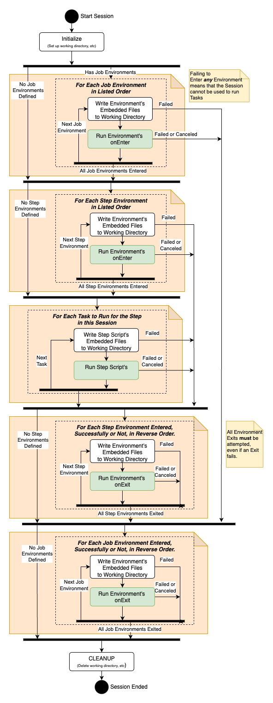

# Open Job Description: How Jobs Are Run

Before reading this we recommend diving into [How Jobs Are Constructed](How-Jobs-Are-Constructed).

## Sessions

Open Job Description's Tasks are run within the context of a **Session**. A **Session** is an ephemeral runtime 
environment on a Worker Host created to run a set of Tasks from the same Job, and is destroyed when the Worker Host is 
done running Tasks for that Job. The **Session** provides a way for you to customize the environment that your Tasks 
run within, such as defining a shared set of environment variables or starting a container to run Tasks. Allowing 
multiple tasks to execute within the same **Session** **Environment** also allows for costly set up and tear down operations
to be used for multiple Tasks, resulting in more efficient job execution. This additionally allows for operations like
installing software or downloading files to the host.

A temporary **Working Directory** is created on the Worker Host for each **Session**, and deleted once all the Tasks 
within that session have completed running, any **Environments** exited, and the **Session** terminated. The 
**Working Directory** is available as scratch space for the Tasks running within the **Session**, which enables things 
like sharing data between Tasks.

A Job and/or Step can define zero or more **Environments** that must be entered in a defined order at the start of
a **Session** prior to running any Tasks, and exited in the reverse order prior to terminating the **Session**. An 
**Environment** defines **Actions**, command-lines with arguments, to run when it is entered or exited, and may also 
define a set of environment variable values that become available in all subsequent **Actions** run in the **Session**
until the **Environment** is exited.

Once the **Environments** have been created and entered for a **Session**, a series of Tasks are run within that 
**Session** and the **Environments**. Tasks from any Step in a Job can run within the same **Session** provided that 
the set of **Environments** that are required to run those Tasks are identical.

All failures and cancellations in a **Session** are terminal for the **Session**, as the system generally does not know 
what state a failure or cancellation leaves the **Session** in. Think of a Task failure which inadvertently terminates 
the container that was set up in an **Environment** for the Tasks to run 
within. A failed Task will result in a failed **Session**, which will subsequently exit all **Environments** that the 
**Session** entered or attempted to enter, and then be terminated itself.

The following diagram provides an overview of the steps taken to run a Session.



## Host Requirements

Open Job Description provides a mechanism for a Step to impose requirements that must be satisfied for Tasks from the 
Step to be scheduled. Each requirement corresponds to an attribute of a Worker Host or render manager that must be 
satisfied to allow the Step to be scheduled to the Worker Host. Some examples of concrete attributes include 
processor architecture (x86_64, arm64, etc.), the number of CPU cores, the amount of system memory, or available 
floating licenses for an application. We also allow for user-defined requirements whose meaning is specified by the 
user; a `“SoftwareConfig”` requirement whose values could be `“Option1”` or `“Option2”`, for example.

There are two types of requirements: amount and attribute.

Amount requirements are the mechanism for defining a quantity of something that the Worker Host or render manager needs
for a Step to run. They represent quantifiable things that must be reserved — vCPUs, memory, licenses, etc. They are 
always a non-negative floating point value, and a Step can require a certain amount of that capability, “at least 4 CPU 
cores” for example. Further, a quantity of each amount required are allocated to a **Session** while that **Session**
is running on a Worker Host. A Step requiring “at least 4 CPU cores” might result in a **Session** with 4 CPU cores 
allocated to it being created on a Worker Host. Those cores are reserved for that **Session** while it is running on 
the Worker Host. For scheduling purposes, this effectively reduces the number of available cores on the Worker Host by 
4 for the duration of the **Session**. Logically fitting multiple **Sessions** into a single Worker Host is the key 
mechanism by which system resources can be optimized by a render management system.

Attribute requirements are the mechanism for specifying an attribute a Worker Host must have for a Step to be scheduled 
to it. They are always defined on a Worker Host as a set of strings. A Step can assert that it requires a Worker Host to
have specific value(s) of the attribute for it to be scheduled to the Worker Host. For example, a Step may require its 
Tasks run on a host that is in the `"linux"` or `"macos"` family of operating systems, or that a host has the shared 
filesystems `"movie-A"`, `"shared-assets"`, and `"software"` all mounted.

## Stdout/Stderr Messages

Open Job Description defines some special messages that can be emitted on stdout or stderr as a single line by an 
**Action** when it is running within a **Session**. The application that is running the **Action** may intercept these 
messages to convey information about the **Action** to the render management system. These special lines contain one of:

* `openjd_progress: <number>` where `<number>` is a percentile between 0 and 100 that indicates what the progress of 
  the **Action** is.
* `openjd_status: <message>` where `<message>` is any string. This provides a human-readable status message indicating 
  what the **Action** is doing. For example, a status message of `“loading assets”` or `"rendering"` or 
  `"dohickying the whatsits."`
* `openjd_fail: <message>` where `<message>` is any string. This provides a human-readable message that indicates why 
  an **Action** has failed.
* `openjd_env: <var>=<value>` where `<var>` is the string name of an environment variable, and `<value>` is a string. This
  can only be emitted by the **Action** for entering an **Environment**. It defines the value of an environment variable for
  all subsequent **Action**s in the **Session** until the defining **Environment** is exited.
* `openjd_unset_env: <var>` where `<var>` is the string name of an environment variable. This can only be emitted by the
  **Action** for entering an **Environment**. This unsets the given environment variable for all subsequent **Action**s
  in the **Session** until the **Environment** that emitted it is exited.

## Path Mapping

An artists' workstation's filesystem may not match that of the Worker Host that will be running a Task. Shared
filesystems may be mounted in different locations, or the workstation and Worker Host may be different operating systems.
Open Job Description provides mechanisms for running Tasks to discover and correct for these differences in environment.

An application running an Open Job Description **Session** may communicate **Path Mapping Rules** to running subprocesses 
via a JSON file in the **Session**'s **Working Directory**. This allows the render management system, which knows how and
from what environment a Job was submitted, as well as the configuration of the Worker Host, to accurately control path
mapping within the **Session**, by providing a set of programmatically generated **Path Mapping Rules**.

The format for the path mapping rules is:

```yaml
{
   "version": "pathmapping-1.0",
   # The path_mapping_rules list will be empty if there are no path mapping rules defined
   "path_mapping_rules": [ 
      {
         # The path format that the submitting operating system uses
         "source_path_format": "POSIX" | "WINDOWS",
         # The filepath prefix to map (e.g. "/home/user" or "c:\Users\user")
         "source_path": <string>,
         # The location on the worker host where the path can be found
         # (e.g. "/mnt/shared/user" or "z:\")
         "destination_path": <string>
      },
      ...
   ]
}
```

The location of this file, and whether there are path mapping rules defined, are available as value references for
use in [Format Strings](How-Jobs-Are-Constructed#format-strings) within a Job Template. The value references available are:

1. `Session.HasPathMappingRules` -- Has the string value `true` or `false`.
    * `true` — means that the path mapping JSON contains path mapping rules.
    * `false` — means that the path mapping JSON contains no path mapping rules.
2. `Session.PathMappingRulesFile` -- Has a string value providing the absolute file path to the path mapping rules JSON file.
   The JSON object in this file is allowed to be the empty object if there are no path mapping rules defined.

### Applying Path Mapping Rules within a Job Template

The **PATH** type Job and Task parameters provide an integration point in the Job Template for the path mapping system. 
If a collection of path mapping rules are provided to a **Session**, then those rules are applied to all **PATH** type 
parameters when they are resolved in Format Strings. The path mapping rules that are supplied are applied in order of 
decreasing length of the source path, and processing stops for particular value once a rule matches.
