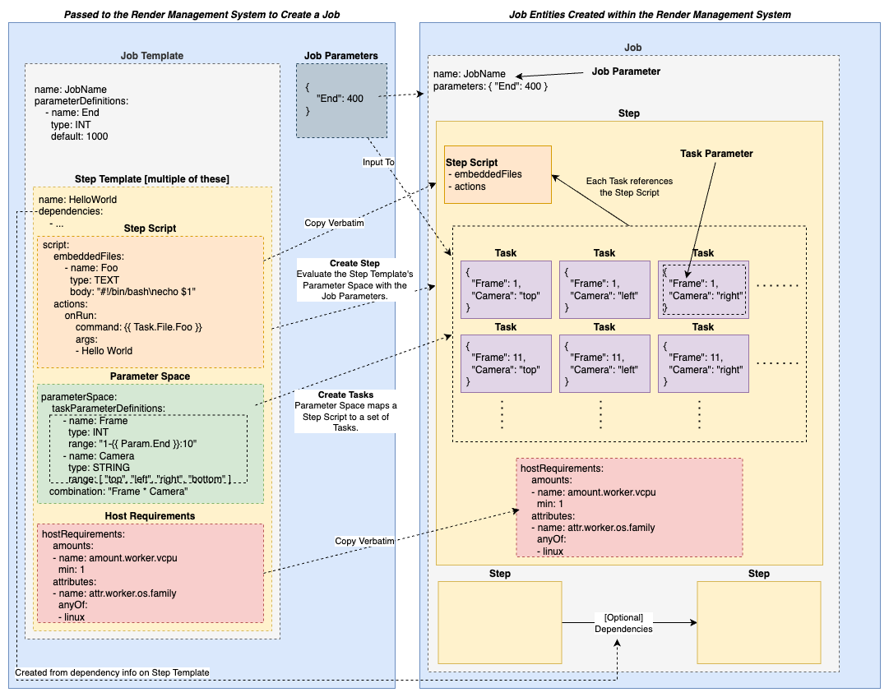

# Open Job Description: Job Structure

Concepts explained: **Job**, **Step**, **Task**, **Job Template**, **Parameters**, and **Task Parameter Space**.

The Open Job Description specification models a Job as a three-level hierarchy — a ***Job*** at the top which contains
a number of ***Steps***, and each Step defining a collection of parameterized ***Tasks***. The ***Job*** is what is submitted to
a render management system. It is parameterized and defines a directed acyclic graph of Steps, the edges of which define
dependencies — which Steps must be completed before which — between the Steps of the Job. Each ***Step*** in a Job defines a
specific parameterized action to perform — rendering the frames of a shot, encoding a video, or something else. A Step’s action in
combination with a concrete set of values for its parameterization defines a ***Task***; the ***Task*** is the unit of
schedule-able work run on  by the workers in the render management system.

The action performed by a Step is defined by the ***Step Script***. This consists of a command to run, and a set of optional
embedded files that can be used to include the contents of a text file (shell script, python script, json document, etc) within the
definition of the Step rather than on a shared medium such as a filesystem. The Step Script can be parameterized. We call each of
these parameters a ***Task Parameter***. In addition to a Step Script, a Step also defines the ***Step Parameter Space***. The
Parameter Space maps a Step Script to a set of Tasks where the values of a Task's Task Parameters specifify its coordinates in
that space.

Finally, a Job is defined via a ***Job Template***. The Job Template describes the shape of a job — what the parameterization of
the Job is, and what its Steps are. The parameterization available to a Job Template allows you to author a single Job Template
that can be used to create many Jobs in a render management system that all perform the same actions, but on different input
values. To create a Job you provide both a Job Template and a set of values for all of the **Job Parameters** defined in the Job
Template. The render management system can then use the provided Job Parameter values to instantiate the Job Template to create a
Job.
