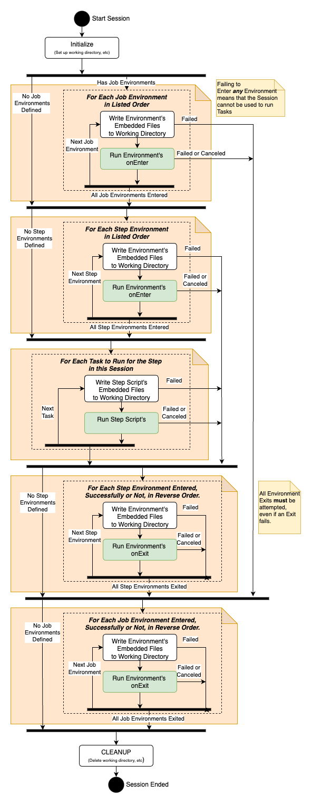

# Open Job Description: How Jobs Are Run [Version: 2023-09]

Concepts introduced: **Session**, **Environment**, **Action**, **Working Directory**, **Host Requirements**, **Stdout/Stderr Handlers**, and **Path Mapping**.

Pre-requisite reading: [[Job Structure]]

## Sessions

Open Job Description's Tasks are run within the context of a **Session**. A Session is a type of ephemeral runtime environment on
a Worker host that is created to run a set of Tasks from the same Job, and is destroyed when the host is done running Tasks
for that Job. The Session provides a way for you to customize the environment that your Tasks run within; for example, defining a
shared set of environment variables or starting a container to run Tasks within. It also provides a vehicle to amortize expensive or
time-consuming setup and tear-down operations; installing software or downloading files to the host, for example.

A temporary **Working Directory** is created on the host for each Session, and deleted once that Session has
completed running on the host. This directory is available as scratch space for the things running within the Session; such as
sharing data between Tasks that are run within the same Session.

A Job and/or Step can define zero or more **Environments** that must be entered in a defined order at the start of
a Session prior to running any Tasks, and exited in the reverse order prior to terminating the Session. An Environment defines
**Actions** -- a command-line with arguments -- to run when it is entered or exited, and may also define a set of environment
variable values that become available in all subsequent Actions run in the Session until the Environment is exited.

Once the Environment has been created and set up for a Session, a series of Tasks are run within that Session. Tasks
from any Step in a Job can run within the same Session provided that the set of Environments that are required run those
Tasks are identical.

Finally, the system generally does not know what state a failure or cancelation would leave the Session in -- for example, a Task
failure could inadvertantly terminate or crash the docker container that was set up in an Environment for Tasks to run within --
so, all failures and cancelations in a Session are terminal for the Session. A terminal Session will exit all environments
that the Session entered or attempted to enter, and then be terminated itself.

The following diagram provides an overview of the steps taken to run a Session.



## Host Requirements

Open Job Description provides a mechanism for a Step to impose requirements that must be satisfied for Tasks from the Step to
be scheduled. Each requirement corresponds to an attribute of a host or render manager that must be satisfied to allow the Step to
be scheduled to the host. Some examples of concrete attributes include processor architecture (x86_64, arm64, etc), the
number of CPU cores, the amount of system memory, or available floating licenses for an application. We also allow for
user-defined whose meaning is defined by the customer; a “SoftwareConfig” requirement whose values could be “Option1” or “Option2”,
for example.

There are two types of requirements: attribute and amount.

Amount requirements are the mechanism for defining a quantity of something that the Worker host or render manager needs to have
for a Step to run. They represent quantifiable things that need to be reserved to do the work — vCPUs, memory, licenses, etc. They
are always non-negative floating point valued, and a Step can require a certain amount of that capability to be able to run —
“at least 4 CPU cores” for example. Further, a quantity of each amount required are logically allocated to a Session while that
session is running on a host. A Step requiring, say, “at least 4 CPU cores”, might result in a Session with 4 CPU cores allocated
to it being created on a host. Those cores are reserved for that Session while that Session is running on the host; effectively
making the number of available cores on the host 4 less for scheduling purposes during the duration of the Session. Logically
allocating amounts to Sessions is the key mechanism by which system resources can be optimally utilized through bin packing
multiple running Sessions onto hosts at the same time.

Attribute requirements are the mechanism for defining an abstract or concrete attribute/property a host must to have for
a Step to run on that host. They are always defined on a host as a set of strings. A Step can assert that it requires that a host
have specific value(s) of the attribute for it to be scheduled to the host. For example, a Step may require that its Tasks run
on a host that is in the "linux" or "macos" family of operating systems, or that a host has the shared filesystems "movie-A",
"shared-assets" and "software" all mounted.

## Stdout/Stderr Messages

Open Job Description defines some special messages that can be emitted on stdout or stderr as a single line by an Action when it
is running within a Session. The application that is running the Action may intercept these messages to convey information about
the Action to the render management system. These special lines contain one of:

* `openjd_progress: <number>` where `<number>` is a percentile between 0 and 100 that indicates what the progress of the Action is.
* `openjd_status: <message>` where `<message>` is any string. This provides a human-readable status message indicating what the
   Action is doing. For example, a status message of “loading assets” or "rendering" or "dohickying the whatsits."
* `openjd_fail: <message>` where `<message>` is any string. This provides a human-readable message that indicates why an Action
   has failed.

## Path Mapping

An artists' workstation's filesystem may not match that of the Worker host that will be running a Task. Shared
filesystems may be mounted in different locations, or the workstation and Worker host may be different operating systems.
Open Job Description provides mechanisms for running jobs to discover and correct for these differences in environment.

An application running an Open Job Description Session may communicate ***path mapping rules*** to running subprocesses via
a JSON file in the Session's Working Directory.

The format for the path mapping rules is:

```yaml
{
   "version": "pathmapping-1.0",
   # The path_mapping_rules list will be empty if there are no path mapping rules defined
   "path_mapping_rules": [ 
      {
         # The path format that the submitting operating system uses
         "source_path_format": "POSIX" | "WINDOWS",
         # The filepath prefix to map (e.g. "/home/user" or "c:\Users\user")
         "source_path": <string>,
         # The location on the worker host where the path can be found
         # (e.g. "/mnt/shared/user" or "z:\")
         "destination_path": <string>
      },
      ...
   ]
}
```

The location of this file and whether or not there are path mapping rules defined are available as value references for
use in [[[2023-09] Format Strings|[2023-09]: Format Strings]] within a Job Template. The value references available are:

1. `Session.HasPathMappingRules` -- Has the string value `true` or `false`.
    * `true` — means that the path mapping JSON contains path mapping rules.
    * `false` — means that the path mapping JSON contains no path mapping rules.
2. `Session.PathMappingRulesFile` -- Has a string value providing the absolute file path to the path mapping rules JSON file.
   The JSON object in this file is allowed to be the empty object if there are no path mapping rules defined.

### Applying Path Mapping Rules within a Job Template

The ***PATH*** type Job and Task parameters provide an integration point in the Job Template for the path mapping system. If a
collection of path mapping rules is provided to the application that is running a ***Session***, then those rules are applied to all
***PATH*** type parameters when they are resolved in Format Strings. The path mapping rules that are supplied are applied in order
of decreasing length of the source path, and processing stops for particular value once a rule matches.
